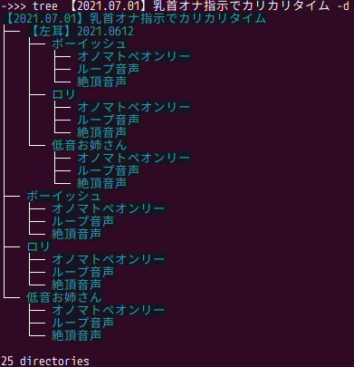

# Random Nipple Player

[](https://pypi.org/project/random-nipple-player) [](https://github.com/eggplants/random-nipple-player/releases)

音声作品「[乳首オナ指示でカリカリタイム](https://www.dlsite.com/maniax/work/=/product_id/RJ323807.html)」(RJ323807)用のプレイヤー


## 使い方

- 事前に上記の音声作品を購入し、分割ファイルをダウンロードして解凍しておく
- `【2021.07.01】乳首オナ指示でカリカリタイム`のみに対応(以下の画像参照)



- 下記の方法で起動した画面で作品フォルダを指定

### ダウンロードした実行ファイルから起動

[Releases](https://github.com/eggplants/random-nipple-player/releases)から対応する OS(Windows, Macos, Linux)のファイルをダウンロード, 解凍し実行

### pipからインストールして起動

```bash
# 必要: libasound2-dev, tk-inter >= 8.6
pip install random-nipple-player
rnp # 実行すると画面が起動する
```

## 作者

Haruna (eggplants)

## ライセンス

MIT
